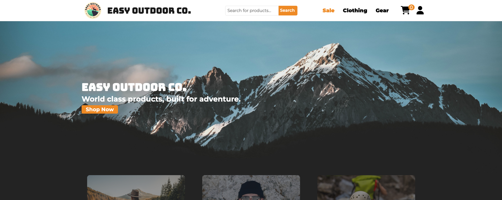
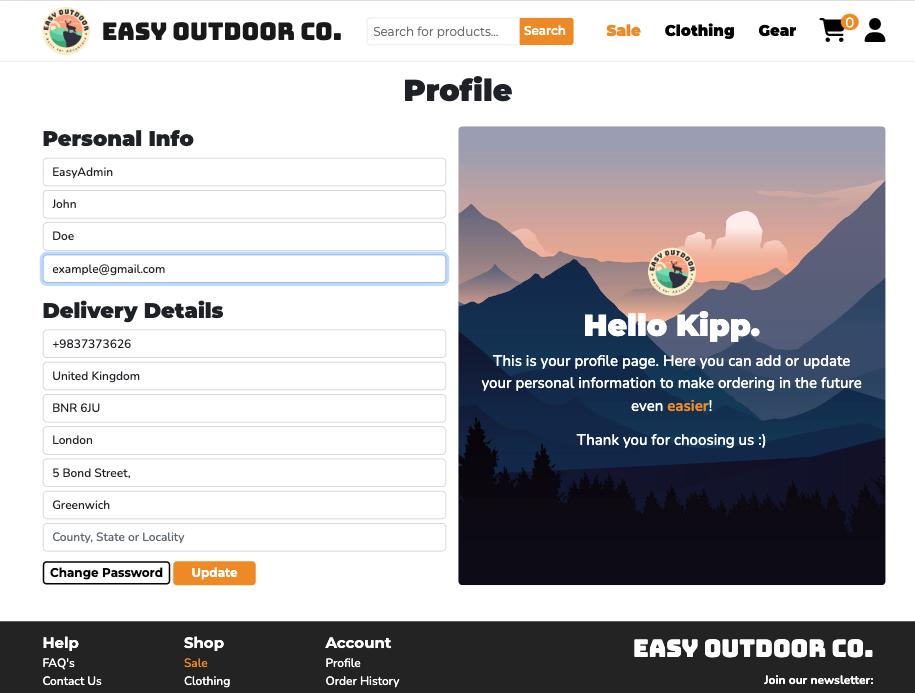
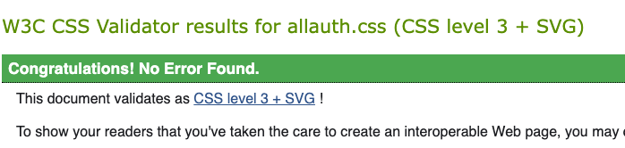
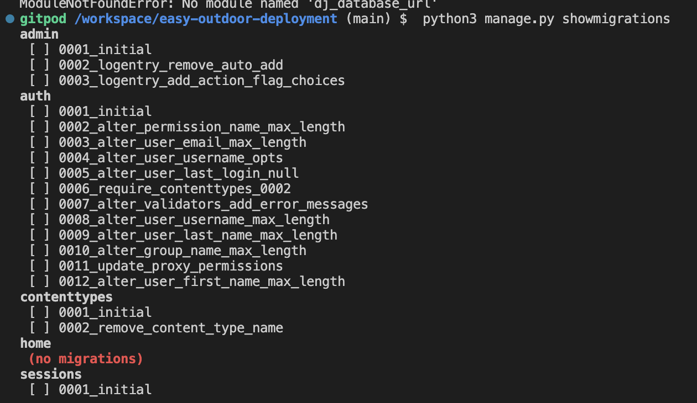
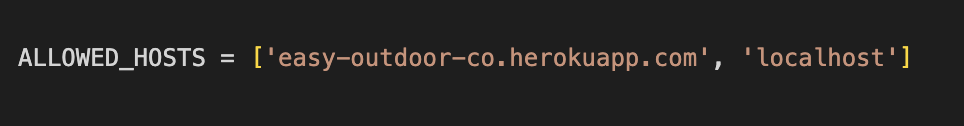

# **The Easy Outdoor Co.**



## **Brief**
The Easy Outdoor Co. is an e-commerce site for a fictional store that sells clothing and equipment for outdoor activities. The application takes payments using Stripe and logs orders in the database. Features for the site owner include adding and updating products, deleting stock, and sending newsletters to a mailing list. Users are able to create an account, review products, and make orders. 

This project was undertaken as my Milestone 5 E-commerce project for my Full Stack Software Engineering diploma with Code Institute. The project was planned using Agile methodology and built using the Django framework alongside various other technologies.

[**Link to Live Site**](https://easy-outdoor-co.herokuapp.com/)

## **Planning**

### **Objectives**

Planning this project required considering the ideal goals of the user, the site owner, and the necessary steps to achieve them as the developer of the project. At the highest level of abstraction these goals are:

- **User**: The user wants to be able to browse for products and buy them easily.
- **Owner**: The owner wants to be able to profit off the business and manage the store.

#### **To achieve these goals:**

**User**:
- Create an interface that the user can move through intuitively.
- Site actions are clear and the user can achieve their objectives without hassle.
- The site is aesthetically attractive and users enjoy using it.
- Content is organized in a hierarchy of importance so that users can get where they need to be quickly.

**Owner:**
- SEO will improve the websites traffic and therefore increase the amount of orders made.
- Marketing such as a newsletter and social media will ensure that users return to the site and increase the amount of sales.
- A custom admin UI will improve the owners User Experience by making CRUD on the database more intuitive.
- Managing discounted prices, products, sending newsletters are all easily achieved from within the UI.

## **User Stories**
By considering the requirements for the User and Owner, as well as the intended marketing techniques, I could then break the requirements of a successful development into epics. From there I broke the epics down into User Stories which were used to decide on the project’s required features.

### **Epic: Site Navigation**

A clear, well designed, and simple UI that allows both staff and customers to use navigate the site easily.

<details><summary><b>Site Navigation User Stories</b></summary>
 <br/>
  
- As a **user** I can **easily navigate the site** so that **I can access the different areas of the shop and complete user actions intuitively**
- As a **user** I can **view products** so that **I can browse the products for sale on the site**
- As a **user** I can **filter products by category** so that **I can narrow down shopping searches to items relevant to my interests**
- As a **user** I can **search for products** so that **I can query for specific items of interest faster**
- As a **user** I can **sort product search results** so that **I can filter through products by various attributes intuitively**
- As a **user** I can **view a list of frequently asked questions** so that **I can have my queries answered without contacting the site admin**
  
</details>
  
### **User Epic: Buying Products**

Buying products is simple and quick and all of the relevant information to make an order is clear to the user.

<details><summary><b>Buying Products User Stories</b></summary>
 <br/>

- As a **user** I can **select the sizes of items** so that **I can choose specific clothing sizes when I buy items**
- As a **user** I can **add products to a basket** so that **I can store items in a list of products to purchase as I navigate through the site**
- As a **user** I can **clearly see what items are currently in stock** so that **I am aware which items can be ordered immediately**
- As a **user** I can **see the total cost of my order** so that **I am aware exactly how much I am required to pay**
- As a **user** I can **view delivery costs** so that **I am aware of any surplus charges to my order**
- As a **user** I can **see discounted products** so that **I am aware of opportunities to save money on purchases**
- As a **user** I can **update the quantity of items in the basket** so that **I can easily manage the items I wish to order**
- As a **user** I can **remove items from the basket** so that **I can delete any unwanted items from my order**
- As a **user** I can **make secure payments** so that **I can safely order items with my card**
- As a **user** I can **update the quantity of items in the basket** so that **I can easily manage the items I wish to order**
- As a **user** I can **join a newsletter** so that **I can be made aware of any news or promotions running in the store**

</details>
 
### **Epic: Account Management**

Users can create a profile, manage their own information and speed up the checkout process with saved personal data.

<details><summary><b>Account Management User Stories</b></summary>
 <br/>

- As a **user** I can **create an account** so that **I can manage my personal details and view order history if I am a regular shopper**
- As a **user** I can **save my personal details when checking out** so that **placing orders is faster in future**
- As a **user** I can **manually add my personal information to a profile** so that **I can checkout faster when ordering**
- As a **user** I can **update my profile information** so that **I can keep my personal details up to date**
- As a **user** I can **view my order history** so that **I can access information about unfulfilled and past orders**
- As a **user** I can **change my password** so that **I can keep my account safe and access my profile if I lose my password**
- As a **user** I can **delete my account** so that **I can maintain control over my personal information**
- As a **user** I can **rate products** so that **I can give feedback to the store and other prospective buyers on items that I have purchased**
- As a **user** I can **contact the store** so that **I can have any queries answered by the site admin**
- As a **user** I can **create a wish list of items so that I can save products to buy at a future date**

</details> 
 
### **Epic: Site Management**

Site staff can manage products, update stock, send newsletters and complete other actions that manage the database.

<details><summary><b>Site Management User Stories</b></summary>
 <br/>

- As an **admin** I can **add products to the store** so that **I can keep the product list up to date with new arrivals**
- As an **admin** I can **update existing products** so that **I can manage the information of currently listed products**
- As an **admin** I can **delete existing products** so that **I can remove products from the product database**
- As an **admin** I can **hide products from the store** so that **I can remove out of stock or faulty items from being displayed**
- As an **admin** I can **manage stock** so that **I can maintain that items for sale are available to be bought and shipped**
- As an **admin** I can **add a discount to items** so that **I can create a list of items on sale**
- As an **admin** I can **send a newsletter so that I can keep users up to date with the latest deals or promotions**

</details>
 
The four epics are ranked in terms of priority. In order for the site to function in its most basic state the user needs to be able to navigate the site and buy products. To greatly improve the UX of the user the account management epic can be added next. Finally Django has a built in admin panel so the site management epic is of lowest priority.

### **Business Model**

The Easy Outdoor Co. is an online clothing store that sells its own products directly to customers. This means its business model is a direct seller business to customer (B2C). To make a B2C business model successful, exposure to potential customers is crucial. An onus must be put on marketing techniques to bring in new customers, reliability and trustworthiness to retain customers, and providing the best possible UX in order to set the business apart from the competition - as B2C businesses are the most widespread of the e-commerce types.

In the marketing techniques and SEO sections below there are some strategies taken by the company in order to achieve the aims set above.


### **Marketing Techniques**

An integral part of developing a successful online store is how you can achieve a higher traffic of users.

- **Newsletter:** Using a newsletter subscription allows users to easily opt in to an email that notifies them of the promotions that the store is offering.
- **Social media:** An active social media presence would offer similar advantages to that of a newsletter. It would also allow the running of ads through the social media website, which would reach a much wider audience than that of just the users that have subscribed to the newsletter. There is an instagram page for the website already attached to the link in the footer.
- **Sales:** Sales and promotions in general are an important aspect of bringing customers in. Using discounted products in emails and social media posts will entice users onto the site.

### **Search Engine Optimization**

Search engine optimization will increase the likelihood of users finding the site when searching, therefore increasing the amount of users on the site. This is a crucial step in ensuring that an online business is successful, because without users there won’t be sales. 

**Steps taken to optimize SEO:**

- Content is intended to be meaningful and relevant. Product descriptions are detailed and explain the key selling points for each product.

- The design also contributes to SEO, which ties into the entire UX. By focusing on giving a good User Experience the user is more likely to stay on the site rather than clicking back to search results, and also move through different pages on the site. This improves SEO metrics such as bounce rate, session time, dwell time and pages per session.

- External links use the rel=noopener attribute to distinguish them from internal links for the SEO to know that they aren’t relevant to the site.

- XML Sitemap lists important URLs so that search engines can crawl through the site and understand the site structure. It also allows search engines to discover content quicker.

- Robots.txt file limits areas of the site that a search engine can access and is seen by them as a mark of quality - this improves SEO.

- Keywords and description in the site head contribute to SEO. Deciding upon keywords came from considering phrases that would be most relevant to the products that the site sells. Then using the site [wordtracker.com](https://www.wordtracker.com/) I was able to see suggested keywords and their volume of search. This helped inform the final list of keywords.

## **Project Management**
The user stories were added to a project board on this repository's project board so that development could be managed incrementally.

[**Project Board**](https://github.com/users/KippAD/projects/6/views/1)

## **Design**

### **Design Objective**
- The site is aesthetically appealing and users enjoy being on it.
- Users are able to complete site actions and navigate intuitively.
- The user rarely encounters errors but is redirected appropriately when doing so.
- Site information is presented in a hierachy of importance.

### **Wireframes**

The wireframes on the site were created with Figma. The design itself was intended to be fairly simple to keep the entire experience for the user as neat and uncomplex as possible and to avoid creating a visual overload.

# **Features**

## **Navbar**


The navbar allows easy and intuitive navigation throughout the site. Built from bootstraps responsive navbar template, the navigation bar minimizes into a burger menu on smaller screens and features dropdowns to contain all of the necessary links.

<details><summary><b>Features</b></summary><br>

- **Burger Menu** - The navbar transforms into a burger menu so that the page isn’t crowded with links on smaller devices.
- **Search Bar** - The search bar allows the user to quickly search for products from anywhere on the site; they will be transported to a list of products matching their query upon submitting.
- **Profile Icon** - The profile icon features a dropdown menu that allows the user to view their profile and order history. The icon is dynamic so that it only displays if a user is logged in, otherwise it shows a login link. It also displays a link to the admin panel if the user is a staff member.
- **Basket Icon** - The basket icon in the navbar will display the total amount of different items in the basket. It also allows the user to access their shopping basket from anywhere on the site.

</details>

---

## **Home**


Most of the site is quite simple in its design, usually using black and white colors with an orange color to signify user actions. This is not to overload the user when they are trying to use the site's functionality. The homepage however is the first place that the user lands, so there is an impetus on a more complex but enticing design in order to persuade the user to stay, as well as concise information that explains the site's purpose.

<details><summary><b>Features</b></summary><br>

- **Hero Image** - The hero image is the first thing the user sees. The idea is that they are drawn in by an impressive image and a catchy overlay text so that they can quickly surmise what the purpose of the store is.
- **Shopping Panels** - The panels link to the three main sections of the shop; the sale, clothing, and equipment. These images draw the user in more to the necessary actions to view products more so than the smaller links in the navbar.
- **About Us** - This describes the purpose of the store in much more detail than the hero overlay, allowing the user to unravel information about the site as they move through it rather than overloading them with content all at once.
- **Product Carousel** - The product carousel is a scrollable assortment of random items from the store. If a first time user is seeing this feature they have potentially not seen a product yet. This feature brings the product section to them, showing them the sort of items that are sold without them having to navigate to a different area.
- **Footer** - The footer contains mosts of the navigation that has already been shown in the navbar and the home page. It also includes a newsletter subscription form and a link to the sites instagram page.

</details>

<details><summary><b>Images</b></summary><br>
 
### **Navbar, Hero Section & Shopping Panel Links**


### **About Us Section**

 
### **Products Carousel & Footer**


</details>

---

## **Products**


The products section displays all of the products for sale on the store, and also allows the user to sort or filter them by different categories to help them narrow items down to those that are relevant to them.

<details><summary><b>Features</b></summary><br>
 
- **Discounted Items** - Items with a discounted price display both the original price and the sale price. This shows the user the amount of money they can save on an item during its promotion period. The sale tab also limits all products to those that are discounted, meaning the user can browse all discounted items at once.
- **Sorting Dropdown** - The user can quickly sort items by their name, price, category and rating. This improves their user experience by streamlining their search.
- **Reviews** - The user is able to see the star rating of the product, and can also see the amount of reviews left on a specific item. From there they can view the reviews and comments left by users on items of interest.
- **Product Detail** - Upon clicking a product in the main product page, the user is brought to the product detail page. This page displays the product information, as well as a quantity selector and a size selector that the user can use to add the product to the basket.
- **Related Products** - The product detail page also contains a related products carousel which contains products of the same category as that of the product the user is viewing. This allows them to continue their search easily with relevant items if they are not interested in purchasing the item in the product detail.
 
</details>


<details><summary><b>Images</b></summary><br>
 
### **Products Page**


### **Product Detail**

 
### **Sale**


</details>

---

## **Basket**


The basket is accessed by the shopping cart icon in the navbar. It contains every item added to the basket by the user, their size, quantity, price, and total price. The user is able to manage the products from there by increasing or decreasing their quantity, or removing them entirely.

<details><summary><b>Features</b></summary><br>

- **Quantity Input** - The user can update the total quantity of their items from the basket. This allows them to control their shopping basket easily, and manage the total cost of the order.
- **Remove From Basket** - The user can remove items from the basket by setting the quantity to 0 or by selecting the x icon on the item’s panel.

</details>

<details><summary><b>Images</b></summary><br>
 
### **Stock Warning**


### **Updated Basket**

 
### **Empty Basket**


</details>

---

## **Stock**


The site features stock management. Stock can be managed by staff and is automatically adjusted when orders are completed.

<details><summary><b>Features</b></summary><br>
  
- **Dynamic Stock** - Stock is automatically decremented when sales are completed. Out of stock items remove the ability to add the product to the basket.
- **Basket Validation** - Stock value is used to validate the quantity of items added to the basket. This prevents users from setting a quantity greater than the remaining stock and putting the business in a position where they cannot fulfill their orders.
 
</details>

<details><summary><b>Images</b></summary><br>
 
### **Stock Error Basket**


</details>

---

## **Account & Profile**



The user can manage their account and view order history by accessing the user icon in the navigation bar. They are able to manage their personal details and keep track of their orders. Allauth is used to manage the users login, password and confirmation emails.

<details><summary><b>Features</b></summary><br>

- **Profile** - The user profile section is where the user can add and update their personal details and delivery information. Their information is then used to speed up the checkout process by preloading the checkout form to improve their user experience.
- **Order History** - The user is able to view details about previous orders. They are also able to rate items if they have purchased them, and are shown the ratings that they have given items after reviewing them.
- **AllAuth** - AllAuth allows the user to easily access and administer their account, with the templates being customized to fit the design of the website.
 
</details>

<details><summary><b>Images</b></summary><br>
 
### **Profile**


### **Order History**

 
### **Sign In Form**

 
### **Sign Up Form**


</details>

---

## **Reviews**


The user is able to give a star rating and leave a comment review of products that they have previously bought. Giving feedback gives a way for the user to interact with the site and also informs prospective buyers on products of interest.

<details><summary><b>Features</b></summary><br>

- **Star Rating Selector** - The review form contains a radio selector styled into a five star input. The value is parsed into a float value which is added to the database. The rating displayed on the product is the average value of all combined ratings.
- **Comment** - The user can also use the comment box to leave a description of the production which will be fed back to the site owner and displayed on the site for other users.

</details>

<details><summary><b>Images</b></summary><br>
 
### **Reviews**


### **Review Form**


</details>

---

## **Custom Admin**


To improve the experience of site staff, a custom admin UI was built to complete site actions such as product and stock management. From this panel staff members can complete CRUD on products, view orders, manage stock, manage the mailing list, and send newsletters.

<details><summary><b>Features</b></summary><br>
 
- **Sorting Tables** - The information on the database is displayed in a sorting table that includes pagination and a search bar. This means that staff can move through large amounts of data easily, and in a friendlier way than the default django admin.
- **Product CRUD** - Staff can create, update, and delete products from the database from within the UI.
- **Stock Management** - Staff can keep a products corresponding stock up to date from within the UI. This allows them to easily maintain items that are available for sale on the store.
- **Order List** - Staff can see a list of all orders and view them in detail in another page. This means that sales can be tracked easily, the site owner can see how well the store is doing, and specific orders can be found without hassle.
- **Mailing List** - Staff can remove users from the mailing list and update their details if necessary.
- **Newsletter** - Staff can also send newsletters from within the admin panel, which builds off of a base newsletter template and adds the subject and content from the input of the user. A summernote editor means that the message can be formatted well and promotional emails can be well styled.

</details>


<details><summary><b>Images</b></summary><br>
 
### **Admin Dashboard**


### **Add Product Form**

 
### **Newsletter Form**

 
### **Order Detail**


</details>

---

## **Secure Checkout**


The checkout process features a delivery form and a stripe payment form, as well as a final summary of the order before the user decides to purchase. There is also a confirmation page that displays upon completion of the order.

<details><summary><b>Features</b></summary><br>
 
- **Checkout Form** - The checkout form takes the users personal and delivery information, validating it before completing the process. There is also a final summary of the items in the order and an option to save the users information to their profile upon completion. A spinner displays to prevent the user from submitting multiple payments whilst the order is being processed.
- **Order Summary** - Upon a successful order, the details of the order are displayed on a new page with a notification stating that the order has been completed and that a confirmation email has been sent.

</details>


<details><summary><b>Images</b></summary><br>
 
### **Main Checkout**


### **Checkout Success**

 
### **Spinner**


</details>

---

## **Newsletter, Contact Form & Emails**


Custom html email templates were built for allauth and django emails which are triggered for events such as an order being completed or the newsletter being subscribed to.

<details><summary><b>Features</b></summary><br>

- **Newsletter** - Users can subscribe to a mailing list and receive emails sent by site staff. These emails feature a custom template and can be sent by staff from the admin panel. Users receive an email upon subscribing successfully to the newsletter.
- **Order Confirmation Email** - Users receive a confirmation email upon completing an order successfully. The email contains all of the relevant information about the order.
- **Allauth Emails** - The default allauth emails for resetting a password and for verification of a new account have been customized to be consistent with other site emails.
- **Contact Form**  - There is a contact form that is linked to the main email address of the site owner where users can query with any questions or issues that they are facing when using the site. The message is validated and sent to the owner along with the email that the user wishes to be contacted with.

</details>

<details><summary><b>Images</b></summary><br>
 
### **Contact Form**


### **Subscription Confirmation Email**

 
### **Order Confirmation Email**


</details>

---

## **FAQ’s**


The user can see a list of frequently asked questions to answer any questions that they might have.

<details><summary><b>Features</b></summary><br>
 
- **Accordion** - The FAQ’s are formatted in a Bootstrap accordion to present the large amount of text in bitesize quantities so that the user can navigate to helpful answers easily.
 
</details>

<details><summary><b>Images</b></summary><br>
 
### **FAQ Accordion**


</details>

---

## **Future Features**

- **Stock Anayltics** - A future feature would be an interface that informs the admin on sales so that they can make decisions on how much stock to order, or which items are the most popular and which are not performing as well.

- **Wishlist** - A feature that was intended to be included in this iteration of development was a product wishlist. This would allow users to make a list of products that they can return to later on if they wish to buy them. Unfortunately this feature did not make it in due to time constraints, however it would be a useful thing to add in future.

- **Stock Notification** - Another intended feature was an email sent to the user of when stock comes back into the store of a specific item. The user would be able to opt in to this from the product detail. This feature was not added as others were prioritized to meet the deadline.

- **Womens Section** - Currently the site only stocks men's clothes. A future development could be to add women's stock and the corresponding size models.

## **Testing**

### **Testing User Stories**

#### **Epic: Site Navigation**

  
<details><summary><b>As a user I can easily navigate the site so that I can access the different areas of the shop and complete user actions intuitively</b></summary><br/>
COMPLETE:The navigation bar and footer mean that the user is able to move through the site easily to get to their desired area. Buttons and links are consistently designed throughout the site so that the user can build familiarity with navigation elements.
</details>

<details><summary><b>As a user I can view products so that I can browse the products for sale on the site</b></summary><br/>
COMPLETE: The products section is clearly accessible from the navbar and footer so that viewing products can be achieved from anywhere on the site.
</details>

<details><summary><b>As a user I can filter products by category so that I can narrow down shopping searches to items relevant to my interests</b></summary><br/>
COMPLETE: Products are categorized and can be filtered by selecting the chosen category in the top navbar.
</details>

<details><summary><b>As a user I can search for products so that I can query for specific items of interest faster</b></summary><br/>
COMPLETE: There is a search input in the navigation bar which allows the user to query specific products from anywhere in the site.
</details>

<details><summary><b>As a user I can sort product search results so that I can filter through products by various attributes intuitively</b></summary><br/>
COMPLETE: The products page includes a sorting dropdown that allows the user to filter items by attributes such as price, rating, and name.
</details>

<details><summary><b>As a user I can view a list of frequently asked questions so that I can have my queries answered without contacting the site admin</b></summary><br/>
COMPLETE: There is a FAQ page that contains information in the site in much more detail so that the user can resolve any issues they might have.
</details>

<details><summary><b>As a user I can contact the store so that I can have any queries answered by the site admin</b></summary><br/>
COMPLETE: There is a contact form the allows the user to send an email directly to the main site email, the user is forced to include their email address so that the site owner knows who to send the response to.
</details>

#### **Epic: Buying Products**

<details><summary><b>As a user I can select the sizes of items so that I can choose specific clothing sizes when I buy items</b></summary><br/>
- **COMPLETE:** On the product detail there is a size selector which will show the user if the item has sizes and allows them to select one before adding it to the basket.
</details>
 
<details><summary><b>As a user I can add products to a basket so that I can store items in a list of products to purchase as I navigate through the site</b></summary><br/>
COMPLETE: There is add to product functionality from the product detail pages. Users can select the quantity and size of the item before adding it to the basket. There is validation to prevent users from adding more quantity than available stock.
</details>
 
<details><summary><b>As a user I can clearly see what items are currently in stock so that I am aware which items can be ordered immediately</b></summary><br/>
INCOMPLETE: The product detail displays whether an item is in stock or not. Sized items also display if a particular size is low on stock. However there is no functionality to filter out of stock items from the product list.
</details>

<details><summary><b>As a user I can see the total cost of my order so that I am aware exactly how much I am required to pay</b></summary><br/>
COMPLETE: Total order cost is displayed in the basket and checkout. It also appears in the success toast of adding a product to the basket.
</details>
 
<details><summary><b>As a user I can view delivery costs so that I am aware of any surplus charges to my order</b></summary><br/>
COMPLETE: Delivery cost is displayed in the basket and checkout. It also appears in the success toast of adding a product to the basket.
</details>
 
<details><summary><b>As a user I can see discounted products so that I am aware of opportunities to save money on purchases</b></summary><br/>
COMPLETE: Discounted prices can be easily seen in the product list and detail as a new value with the old price crossed out. There is also a sale tab to filter all discounted items into one search.
</details>
 
<details><summary><b>As a user I can update the quantity of items in the basket so that I can easily manage the items I wish to order</b></summary><br/>
COMPLETE: Total order cost is displayed in the basket and checkout. It also appears in the success toast of adding a product to the basket.
</details>
 
<details><summary><b>As a user I can remove items from the basket so that I can delete any unwanted items from my order</b></summary><br/>
COMPLETE: Users are able to remove individual items from the basket with the x icon. They can also set the quantity to 0 or to a negative number and the same outcome is achieved.
</details>
 
<details><summary><b>As a user I can make secure payments so that I can safely order items with my card</b></summary><br/>
COMPLETE: Stripe functionality securely takes payments for orders and appears in the dashboard. A spinner overlay hides the form and prevents the user from accidentally making double payments.
</details>
 
<details><summary><b>As a user I can update the quantity of items in the basket so that I can easily manage the items I wish to order</b></summary><br/>
COMPLETE: Users are able to increment and decrement their quantity from within the basket. These inputs are validated to prevent quantity from being greater than the remaining stock.
</details>
 
<details><summary><b>As a user I can join a newsletter so that I can be made aware of any news or promotions running in the store</b></summary><br/>
COMPLETE: Users can sign up to a mailing list from the form in the footer. They receive a confirmation email upon submitting the form, and then receive any newsletters the admin might send.
</details>
 
#### **Epic: Account Management**

<details><summary><b>As a user I can create an account so that I can manage my personal details and view order history if I am a regular shopper</b></summary><br/>
COMPLETE: Users are able to sign up easily and receive an email verification in order to complete the registration process.
</details>

<details><summary><b>As a user I can save my personal details when checking out so that placing orders is faster in future</b></summary><br/>
COMPLETE: There is a checkbox on the checkout form that allows a user to take the personal information entered and add it to their profile. If a user is not logged in it gives them the option to register an account or sign in.
</details>

<details><summary><b>As a user I can manually add my personal information to a profile so that I can checkout faster when ordering</b></summary><br/>
COMPLETE: There is a profile page that contains a form for the user to manually add personal and delivery information to their profile.
</details>
 
<details><summary><b>As a user I can update my profile information so that I can keep my personal details up to date</b></summary><br/>
COMPLETE: Users can use the profile form on their profile page to update existing information on their profile and keep their data up to date.
</details>
 
<details><summary><b>As a user I can view my order history so that I can access information about unfulfilled and past orders</b></summary><br/>
COMPLETE: Order history is displayed in the order history page accessed from the profile dropdown menu. There they can see orders they have made and the items they have purchased. A confirmation email sends upon order completion.
</details>

<details><summary><b>As a user I can change my password so that I can keep my account safe and access my profile if I lose my password</b></summary><br/>
COMPLETE: Logged in users are able to change their password through a change password button located on the profile form; they are redirected to a change password form where they can complete the action. Users are also able to request a password reset email from the login page if they forget it, where they will be sent an email with a link to change it.
</details>

<details><summary><b>As a user I can delete my account so that I can maintain control over my personal information</b></summary><br/>
INCOMPLETE: Users are unable to delete or request a deletion for their account automatically. Instead they have to send an email to the site owner to delete the user manually. This is below-par UX so this User Story is considered incomplete.
</details>

<details><summary><b>As a user I can rate products so that I can give feedback to the store and other prospective buyers on items that I have purchased</b></summary><br/>
COMPLETE: Users are able to review products that they have purchased from the order history tab. They are automatically presented with a link to rate the product once they have made a purchase and will be shown a message if they have already rated it. From there they can submit a star rating and leave a comment, which will be displayed on the products reviews section.
</details>
 
<details><summary><b>As a user I can contact the store so that I can have any queries answered by the site admin</b></summary><br/>
COMPLETE: There is a contact form accessed through various areas of the site, but most easily from the footer. In this form they are able to send an email directly to the site owner.
</details>
 
<details><summary><b>As a user I can create a wish list of items so that I can save products to buy at a future date</b></summary><br/>
INCOMPLETE: This user story was not completed. During development it was put on a lower priority due to expected time constraints, so it didn’t make the final deployment. This feature is one that should be implemented in the future.
</details>

#### **Epic: Site Management**

<details><summary><b>As an admin I can add products to the store so that I can keep the product list up to date with new arrivals</b></summary><br/>
COMPLETE: The admin is able to add products by accessing the add product button in the custom admin UI.
</details>
 
<details><summary><b>As an admin I can update existing products so that I can manage the information of currently listed products</b></summary><br/>
COMPLETE: The admin can update existing products from the update products form in the admin UI.
</details>
 
<details><summary><b>As an admin I can delete existing products so that I can remove products from the product database</b></summary><br/>
COMPLETE: The admin can delete existing products from the database in the custom admin UI by selecting the delete product button and confirming the action.
</details>
 
<details><summary><b>As an admin I can hide products from the store so that I can remove out of stock or faulty items from being displayed</b></summary><br/>
INCOMPLETE: This user story was ultimately not completed. Out of stock items simply display that they are out of stock. For an admin to hide a product they would have to delete the model.
</details>
 
<details><summary><b>As an admin I can manage stock so that I can maintain that items for sale are available to be bought and shipped</b></summary><br/>
COMPLETE: The admin is able to manage stock values in the custom admin UI for both sized and regular item stock.
</details>
 
<details><summary><b>As an admin I can add a discount to items so that I can create a list of items on sale</b></summary><br/>
COMPLETE: The admin can add a discounted price to the product model. These products display their discounted value in the products list and can be grouped by accessing the sale link.
</details>
 
<details><summary><b>As an admin I can send a newsletter so that I can keep users up to date with the latest deals or promotions</b></summary><br/>
COMPLETE: The admin is able to send a newsletter to all emails on the mailing list from the custom admin UI. The message input is a summernote field, meaning that content can be meaningfully formatted.
</details>

###

#### **HTML**

The HTML on the application was validated using the [**W3C HTML Validator**](https://validator.w3.org/). Validating the html by using the Github repository sometimes would raise a lot of errors related to Django's built in settings. As these are not accessible, they cannot be resolved. Each page on the website was run through the validator and all errors caused by custom code were otherwise resolved.

**Homepage** - No validation errors.

**Products Page** - No validation errors.

**Product Detail** - No validation errors.

**Basket** - If multiple sizes of same item it causes a multiple ID error. This is because the product ID is dynamically rendered into the template for use in the view.

**Checkout and Success Page** No validation errors

**Manage Site** - No validation errors

<details>


</details>

#### **CSS**

All css files were checked with [**Jigsaw CSS Validator**](https://jigsaw.w3.org/css-validator/) and returned with no errors.

<details>
 
#### **base.css**
  

  
 #### **home.css**
  

  
#### **product.css**
  

  
#### **basket.css**
  

  
#### **profile.css**
  

  
#### **allauth.css**
  

  
#### **checkout.css**
  

  
#### **manage-site.css**
  

  
</details>

### **JavaScript**

JavaScript code on Easy Outdoor Co. was run through the [**Jshint Javascript Validator**](https://jshint.com/). All files an inline code were checked individually to ensure that all custom JavaScript was properly tested. In order to get the correct validation on Jshint, '//jshint esversion: 6'
"/*globals $:false */".* weas added to the top of the validator. This sets the esversion to 6 and also allows Jquery - which all JavaScript on the application was built with.


**Basket**

- basket.html(Inline JS) - Two errors:'newVal' is already defined and 'newVal' used out of scope. This code is taken from a [tutorial](https://css-tricks.com/number-increment-buttons/) and adjusting the variables affects the functionality.

**Checkout**

- checkout.js - One undefined variable: jQuery. This comes from the [JQuery Validation Plugin](https://jqueryvalidation.org/). This could be the potential cause of the error.
- stripe_elements.js - One undefined variable: Stripe. This variable comes from Stripe functionality, potentially why the validator raises an error for it.

**Home**

- faq.html(Inline JS) - Raises no errors or warnings.

**Manage Site**

- manage_site.js - Raises no errors or warnings.
- product_form.js - One undefined variable: jQuery. This comes from the [JQuery Validation Plugin](https://jqueryvalidation.org/). This could be the potential cause of the error.

**Newsletter**

- contact_form.js - Raises no errors or warnings.
- newsletter-form.js(Inline JS) - Raises no errors or warnings.

**Products**

- product_detail.js - Raises the same warning as Basket's basket.html file as the same code is used.
- products.html(Inline JS) - Raises no errors or warnings.

**Profiles**

- mailing_list_form.js - One undefined variable: jQuery. This comes from the [JQuery Validation Plugin](https://jqueryvalidation.org/). This could be the potential cause of the error.
- rate_product.js - Raises no errors or warnings.
- order_history.js(Inline JS) - Raises no errors or warnings.

**Project Level**

- product_form.js - One undefined variable: jQuery. This comes from the [JQuery Validation Plugin](https://jqueryvalidation.org/). This could be the potential cause of the error.
- base.html(Inline JS) - One undefined variable: bootstrap. This JS comes from the bootstrap documentation.

#### **Python**

All custom Python code is validated by the [**Code Institue Pep8 Validator Validator**](https://pep8ci.herokuapp.com/). Most of the issues were related to trailing whitespace and lines that were too long; the IDE has a built in warning system that allowed most of these to be resolved prior to validation. All files where custom Python was added were tested individually from each app. Below are the results from the tests along with the results message.

**Basket**

- apps.py - All clear, no errors found
- contexts.py - All clear, no errors found
- urls.py - All clear, no errors found
- views.py - All clear, no errors found

**Checkout**

- admin.py - All clear, no errors found
- apps.py - All clear, no errors found
- forms.py - All clear, no errors found
- models.py - All clear, no errors found
- signals.py - All clear, no errors found
- urls.py - All clear, no errors found
- views.py - All clear, no errors found
- webhook_handler.py - 2 x E501 line too long (80 > 79 characters). These variables could not be restructured without damaging the logic.
- webhooks.py - 1 x E501 line too long (80 > 79 characters). This variable could not be restructured without damaging the logic.

**Easy Outdoor Co (Main directory)**

- urls.py - All clear, no errors found
- views.py - All clear, no errors found

**Home**

- apps.py - All clear, no errors found
- urls.py - All clear, no errors found
- views.py - All clear, no errors found

**Manage Site**

- apps.py - All clear, no errors found
- forms.py - All clear, no errors found
- urls.py - All clear, no errors found
- views.py - All clear, no errors found

**Newsletter**

- admin.py - All clear, no errors found
- apps.py - All clear, no errors found
- forms.py - All clear, no errors found
- models.py - All clear, no errors found
- urls.py - All clear, no errors found
- views.py - All clear, no errors found

**Products**

- admin.py - All clear, no errors found
- apps.py - All clear, no errors found
- forms.py - All clear, no errors found
- models.py - 1 x 62: E741 ambiguous variable name 'l'. The field name was already coded deep into the logic and unfortunately there wasn't time to change the name and recreate the database items.
- signals.py - All clear, no errors found
- urls.py - All clear, no errors found
- views.py - All clear, no errors found

**Profiles**

- admin.py - All clear, no errors found
- apps.py - All clear, no errors found
- forms.py - All clear, no errors found
- models.py - All clear, no errors found
- signals.py - All clear, no errors found
- urls.py - All clear, no errors found
- views.py - All clear, no errors found

### **Manual Testing**

A series of manual tests were conducted on each page to ensure that every link, form, or site action works as originally intended. Any unresolved errors are detailed in the "Unresolved Bugs" section below testing.

**Homepage**

<details>
  
#### **Navigation Bar**

| Result | Navigation Bar Manual Testing                           |
|--------|---------------------------------------------------------|
| ✓      | Link hover styles function as expected                  |
| ✓      | Links redirect to expected page                         |
| ✓      | Basket icon displays correct amount of items in basket  |
| ✓      | Search bar works as expected                            |
| ✓      | Error toast displays when empty searches are enter      |
| ✓      | Logged in users can access profile dropdown             |
| ✓      | Logged in users profile links redirect to expected page |
| ✓      | Logged out users can login using login icon             |
| ✓      | Login and Logout success toasts appear                  |
  
 #### **Home/Index**
 
| Result | Home/Index Manual Testing                               |
|--------|---------------------------------------------------------|
| ✓      | Shop now buttons hover styles function as expected      |
| ✓      | Shop now links redirect to expected page                |
| ✓      | Shopping panel link hover styles function as expected   |
| ✓      | Shopping panel links redirect to expected page          |
| ✓      | Product carousel displays correct amount of items        |
| ✓      | Product carousel scroller works as expected             |
| ✓      | Product images and name links to correct product detail |
  
 #### **Footer**
  
| Result | Footer Manual Testing                                                      |
|--------|----------------------------------------------------------------------------|
| ✓      | All links redirect to the correct page                                     |
| ✓      | All hover functionality works as expected                                  |
| ✓      | Newsletter form doesn't accept empty name input                            |
| ✓      | Newsletter form doesn't accept empty email input                           |
| ✓      | Newsletter form doesn't accept incorrect email input                       |
| ✓      | Email is added to database if form is valid                                |
| ✓      | Error toast is returned if email is already subscribed to mailing list     |
| ✓      | Success toast is returned if email successfully subscribes to mailing list |
  
</details>

**Products & Product Detail**

<details>

#### **Product List**

| Result | Products Manual Testing                          |
|--------|--------------------------------------------------|
| ✓      | Results counter displays correct amount of items |
| ✓      | All sorting categories sort products correctly   |
| ✓      | Hover styles function as expected                |
| ✓      | Links direct to the correct page                 |
| ✓      | Correct amount of reviews are displayed          |
  
#### **Product Detail**
  
| Result | Product Detail Manual Testing                    |
|--------|--------------------------------------------------|
| ✓      | Correct amount of reviews are displayed          |
| ✓      | Size selector is prechecked on page load         |
| ✓      | Low stock warnings display correctly             |
| ✓      | Sizes disable when out of stock                  |
| ✓      | Quantity form increments as intended             |
| ✓      | Correct quantity is added to basket              |
| ✓      | Correct size is added to basket                  |
| ✓      | Success toast appears upon adding to basket      |
| ✓      | Error toast appears if quantity is too large     |
| ✓      | Carousel displays correct amount of items        |
| ✓      | Product carousel scroller works as expected      |
| ✓      | Carousel links to correct product detail         |

</details>
  
**Basket**
  
<details>
  
| Result | Basket Manual Testing                         |
|--------|-----------------------------------------------|
| ✓      | Correct numbering appears at each line item   |
| ✓      | Quantity input increments as expected         |
| ✓      | Hover styles work as expected                 |
| ✓      | Delete from basket removes the correct items  |
| ✓      | Update button updates quantity correctly      |
| ✓      | Checkout button loads checkout form           |
| ✓      | Back button redirects to products             |
| ✓      | Quantity cannot be greater than stock         |
| ✓      | Error toasts appear at expected moments       |
| ✓      | Success message appears at successful actions |
| ✓      | 0 or negative quantities remove from basket   |
  
</details>

**Checkout**

<details>
  
#### **Checkout**
  
| Result | Checkout Manual Testing                                                                      |
|--------|----------------------------------------------------------------------------------------------|
| ✓      | Correct items appear in summary                                                              |
| ✓      | Correct costs appear in summary                                                              |
| ✓      | Removing any or all items will redirect to the basket                                        |
| ✓      | Delete from basket removes the correct items                                                 |
| ✓      | Form validation works as expected                                                            |
| x      | Form validation errors appear as expected (Issue with name validation - See unresolved bugs) |
| ✓      | Back button redirects to basket                                                              |
| ✓      | Spinner displays as expected                                                                 |
| ✓      | Successful checkout loads order summary page                                                 |
| ✓      | Order confirmation is sent to attached email                                                 |
| ✓      | Profile information is saved if checked                                                      |
| ✓      | Profile information preloads checkout                                                        |
  
#### **Checkout Success**
  
| Result | Checkout Success Manual Testing                   |
|--------|---------------------------------------------------|
| ✓      | Hover styles work as expected                     |
| ✓      | Links direct to correct page                      |
| ✓      | Summary information matches the order information |
| ✓      | Success toast appears on load                     |
  
</details>

**Profile**
  
<details>
  
#### **Profile**
  
| Result | Profile Page Manual Testing                         |
|--------|-----------------------------------------------------|
| ✓      | Username validation only allows alphanumeric        |
| ✓      | Name field validation only allow letters and spaces |
| ✓      | Email field only accepts valid emails               |
| ✓      | Username field is required                          |
| ✓      | Email field is required                             |
| ✓      | Phone number field only allows numbers and plus     |
| ✓      | Hover styles work as expected                       |
| ✓      | Links direct to the correct page                    |
| ✓      | Whitespace inputs are treated as empty              |
| x      | Toast appears on update (See unresolved bugs)       |
  
#### **Order History**
  
| Result | Order History Manual Testing               |
|--------|--------------------------------------------|
| ✓      | Accordion buttons trigger correct dropdown |
| ✓      | Orders are ordered by newest to oldest     |
| ✓      | Unrated items display link to review       |
| ✓      | Rated items display star rating            |
| ✓      | Links direct to correct areas              |
| ✓      | Hover styles work as expected              |
  
#### **Review Products**

Extremely late in to the development a couple of errors pertaining to product reviews arose. The original results had to be reviewed and the entire manual testing process was undertaken again in order to check that the new code hadn't irritated any other functionality. Luckily everything worked as expected.
  
| Result | Product Review Manual Testing                      |
|--------|----------------------------------------------------|
| ✓      | Star selector works as expected                    |
| ✓      | Submitted star value matches correct decimal value |
| ✓      | Message field validation works as expected         |
| ✓      | Review is correctly submitted to database          |
| ✓      | Cancel button redirects to order history           |
| ✓      | Success toast appears on successful submission     |
| ✓      | Review is displayed on the site                    |

</details>

**Manage Site**

<details>
  
| Result | Manage Site/Admin Manual Testing                                               |
|--------|--------------------------------------------------------------------------------|
| ✓      | Admin menu buttons display correct content                                     |
| ✓      | Admin menu buttons hover works as expected                                     |
| ✓      | Admin menu button active works as expected                                     |
| ✓      | Links direct to correct page                                                   |
| ✓      | Product data table search and sorting works as expected                        |
| ✓      | Add product form validation works as expected                                  |
| ✓      | Add product form adds product to database                                      |
| ✓      | Update product form preloads correct information in form                       |
| ✓      | Update product form validation works as expected                               |
| ✓      | Update product form updates existing product in database                       |
| ✓      | Delete product shows correct product on confirmation                           |
| ✓      | Delete product confirmation removes correct product from database              |
| ✓      | Size stock object is created when sized product is created                     |
| ✓      | Regular stock object is created when unsized product is created                |
| ✓      | Success message displays when product is added, updated or deleted             |
| ✓      | Size stock table displays correct data                                         |
| ✓      | Stock forms update stock in database                                           |
| ✓      | Regular stock table displays correct data                                      |
| ✓      | Regular stock form updates stock in database                                   |
| x      | Stock data table search and sorting works as expected (See unresolved bugs)    |
| ✓      | Order data table displays correct data                                         |
| ✓      | Order data table search and sorting works as expected                          |
| ✓      | Order details link displays correct order information                          |
| ✓      | Order details buttons work as expected                                         |
| ✓      | Order details hover styles work as expected                                    |
| ✓      | Users data table displays correct data                                         |
| ✓      | Users data table search and sorting works as expected                          |
| ✓      | Update user form preloads correct data into form                               |
| ✓      | Update user form validation works as expected                                  |
| ✓      | Update user form updates into database                                         |
| ✓      | Success toast displayed when successful submission or deletion                 |
| ✓      | Delete user button loads correct product on delete page                        |
| ✓      | Delete user confirmation deletes correct user from database                    |
| ✓      | Users data table displays correct data                                         |
| ✓      | Users data table search and sorting works as expected                          |
| ✓      | Delete email from mailing list confirmation deletes correct user from database |
| x      | Send newsletter form validation works as expected (See unresolved bugs)        |
| ✓      | Newsletter is sent to mailing list upon submission                             |
  
</details>

**All Auth**
  
<details>
  
| Result | Allauth Manual Testing                               |
|--------|------------------------------------------------------|
| ✓      | Sign in template design correct                      |
| ✓      | Sign in functions as expected                        |
| ✓      | Sign up template design correct                      |
| ✓      | Sign up functions as expected                        |
| ✓      | Already signed up validation works as expected       |
| ✓      | Verification email sent page template design correct |
| ✓      | Verification email is received                       |
| ✓      | Verification email link is valid                     |
| ✓      | Sign out template design correct                     |
| ✓      | Sign out functions as expected                       |
| ✓      | Reset password template design is correct            |
| ✓      | Reset password email is received                     |
| ✓      | Reset password link works as expected                |
| ✓      | Change password template design is correct           |
| ✓      | Change password functions as expected                |
| ✓      | All action toasts appear as expected                 |

</details>

**Contact Form and FAQ**

<details>
  
| Result | Contact Form and FAQ Manual Testing                   |
|--------|-------------------------------------------------------|
| ✓      | Contact form is correctly validated (See known bugs)  |
| ✓      | Email is received by site owner email upon submission |
| ✓      | Links work as expected                                |
| ✓      | Hover styles work as expected                         |
| ✓      | FAQ accordion opens the correct item                  |
| ✓      | FAQ links work as expected                            |
| ✓      | FAQ hover styles work as expected                     |

</details>

### **Responsiveness**

**Mobile Devices**

The site works well on mobile devices, with all design retaining its intergrity accross the tested devices.

<details>
  
| Device           | Mobile Device Responsive Testing |
|------------------|----------------------------------|
| Galaxy S8        | Passed                           |
| Galaxy S8+       | Passed                           |
| Galaxy S9+       | Passed                           |
| Galaxy S20 Ultra | Passed                           |
| Galaxy a51/71    | Passed                           |
| Moto G4          | Passed                           |
| Iphone SE        | Passed                           |
| Iphone XR        | Passed                           |
| Iphone X         | Passed                           |
| Iphone 12 Pro    | Passed                           |
| Pixel 5          | Passed                           |
| Pixel 2XL        | Passed                           |

</details>

**Tablet Devices**

These tablet devices all passed because the site is useable on each of them. It should be stated however that horizontal tablets do sometimes adversely effect the overall design. Forms can appear small on the screen, the data tables in admin can also be a bit too wide - this is defintely an area to be improved on. This is mainly true of the larger screen height devices such as the Kindle Fire HDX - however on other tablet devices in the testing the design works well.

<details>

| Device          | Tablet Device Responsive Testing |
|-----------------|----------------------------------|
| Kindle Fire HDX | Passed                           |
| Ipad Mini       | Passed                           |
| Ipad Air        | Passed                           |
| Surface Pro 7   | Passed                           |
| Surface Duo     | Passed                           |
| Nest Hub        | Passed                           |
| Nest Hub Max    | Passed                           |
| Ipad            | Passed                           |
| Ipad Pro        | Passed                           |
 
</details>

**Larger Devices**

Although the site was intended to be mobile first, the larger devices are probably where the site looks its best. Learning from this I will probably put more focus on creating a great mobile UI as mobile users are potentially the most important target audience.

<details>

| Device      | Larger Screen Widths Responsive Testing |
|-------------|-----------------------------------------|
| 1440 x 900  | Passed                                  |
| 1920 x 1080 | Passed                                  |
 
</details>

### **Browser Testing**

Easy Outdoor Co has been tested on and is compatible with the following browsers:

- **Chrome**
- **Mozilla Firefox**
- **Safari**
- **Opera**

All functionality works as intended and the design remains consistent.

### **Lighthouse Testing**

To test the performance, accessibility, best practices and SEO, a lighthouse test was performed on each of the main areas of the site. As with some of the unresolved bugs on the site some of the warnings come from other dependencies, but there is also room for improvement from my own code. Time constraints limited my opportunities to get each of these metrics as high as possible, although the numbers are green and acceptable in most cases.

**Homepage**

<details>


</details>

**Products**

<details>


</details>

**Product Detail**

<details>


</details>

**Basket**

<details>


</details>

**Checkout**

<details>


</details>

**Manage Site**

<details>


</details>

## **Unresolved Bugs**

- There is no pagination on the products list meaning that long lists of results can take up a lot of vertical space - especially on mobile devices. This is bad UX and will be one of the first issues resolved in future development.

- When updating profile information the intended success message fails to appear. This bug was caused when the view was changed to redirect upon form submission in order to prevent the “Confirm form resubmission” alert from popping up on page refresh. It only occurs when the user is redirected to the same view. The update functionality still works as expected so it is more an issue of bad UX. It was decided that the message not appearing would be slightly preferable to redirecting the user to the home page and displaying the message.

- The stock data tables only sort by name correctly. When sorting by stock quantity the order is seemingly random - it is possible that this is caused by two data tables appearing on the same page. This was not resolved because the JS and CSS are external libraries and there wasn’t enough time to dig into them and see what was causing the issue.

- Contact form whitespace only validation on subject field redirects the user to the home page and displays an error rather than displaying inline on the form. This is an inverse of the updating profile information - it was decided that it would be better to have an error to explain that the form is invalid rather than just refreshing the page and not showing an error. This does technically prevent the incorrect input, it is just less than ideal UX.

- In the admin area it was not possible to validate the Summernote Editor in time. This was a lower priority because the form is only accessed by site staff.


## **Technologies**
The Easy Outdoor Co. website used the following technologies during development:

1.  [**Django**](https://www.djangoproject.com/) - Full stack framework to build database and backend.
2.  [**Bootstrap**](https://getbootstrap.com/) - Front end framework used to build features quickly.
2.  [**Python**](https://www.python.org/) - Application logic and functionality.
3.  [**HTML**](https://en.wikipedia.org/wiki/HTML5) - Templates content and email design.
4.  [**CSS**](https://en.wikipedia.org/wiki/CSS) - Styling content on the site.
5.  [**JQuery**](https://jquery.com/) - Javascript library used for form validation and interactivity.
6.  [**Gitpod**](https://gitpod.io) - The IDE used for the project development.
7.  [**Heroku**](https://dashboard.heroku.com/apps) - Hosting deployed project.
9.  [**Figma**](https://figma.com/) - Wireframe design.
10. [**Real Favicon Generator**](https://realfavicongenerator.net/) - Generating favicon from logo image.
11. [**Sitemap generatore**](https://www.xml-sitemaps.com/) - Generating sitemap for application.
12. [**Amazon Web Services**](https://aws.amazon.com/) - Static and media hosting.
13. [**Unlayered**](https://unlayer.com/) - Email template designer.

## **Additional Dependencie**

1. [**Jquery Validation Plugin**](https://jqueryvalidation.org/) - Jquery client side validation
2. [**AllAuth**](https://django-allauth.readthedocs.io/en/latest/) - Django account management
3. [**Stripe**](https://stripe.com/en-gb-fr) - Processing site payments
4. [**Gunicorn**](https://gunicorn.org/) - Web Server Gateway Interface
5. [**ElephantSQL**](https://www.elephantsql.com/) - Managing Postgres database
6. [**psycopg2**](https://pypi.org/project/psycopg2/) -  PostgreSQL database adapter
7. [**Django Crispy Forms**](https://django-crispy-forms.readthedocs.io/en/latest/) - Elegant form rendering

## **Deployment**

### **To deploy the project**

1. First create a repository on Github using the Code Institute Gitpod full template. To do this head to the template’s page and select **Create a new repository** from the “Use this template” dropdown menu.

<details>


</details>

2. Enter a name for the project, and then select the **Create repository from template** button at the bottom of the form.

<details>


</details>

3. Next create your Gitpod workspace by clicking on the “**Gitpod**” button in the top right of your repository page. This will create the workspace.

<details>


</details>

4. Whilst the workspace is initializing, head over to Elephant SQL and make an account if you do not already have one. You can also sign in with Github. Once logged in, create a **New instance**.

  <details>

  

  </details>

5. First we enter a name for our database and make sure that the free plan is chosen. You can add optional tags if you wish.

<details>


</details>

6. Then we select a region. Choose the region closest to you, and then select **Review**.

<details>


</details>

7. Now we can review our inputs and finally select **Create instance**.

<details>


</details>

8. Now head over to Heroku and either create an account or log in. From the main Heroku dashboard select the **New** dropdown button and choose **Create new app**.

<details>


</details>

9. In the following menu we choose a name and the region closest to you. Then **Create app** to build the app.

<details>


</details>

10. Now in the Heroku settings panel reveal the hidden **Reveal Config Vars**. In the key and value form add a key of **DATABASE_URL**, and then copy the URL from your ElephantSQL app and paste it into the value box.

<details>


</details>

11. Back in your Gitpod workspace we can install Django and our required libraries by running the following commands in the terminal.

```
pip3 install Django==3.2
pip3 install dj_database_url==0.5.0 psycopg2
pip3 install gunicorn
```

12. Now we freeze this packages into a file called requirements.txt with the following command:

```
pip3 freeze > requirements.txt
```

13. Create a file called **Procfile** in the root directory, then add the following syntax:

```
web: gunicorn easy_outdoor.wsgi:application
```

<details>


</details>

14. Now let’s start our project by running the following command (give your project a meaningful and relevant name):

```
django-admin startproject project_name_here
```

15. We have a project started, but now we need to create an app! For this example the app created was called home.

```
python3 manage.py startapp app_name_here
```

16. Whenever we create a new application on Django we need to add it to the installed apps in settings.py.

<details>


</details>

17. Once we have done that, we can migrate our changes using the following commands:

```
python3 manage.py makemigrations
python3 manage.py migrate
```

<details>


</details>

18. If you want to check that everything has worked correctly, run the local server with:

```
python3 manage.py runserver
```

19. Now if you go to the URL you should see the default Django homepage.

<details>


</details>

20. Now we create a file called **env.py** in the base root of our project. This will contain all of our secret keys that we use to connect our application to the database. In the file we need to first:

```
import os
```

21. And then we set a secret key of our choosing. This key should remain in the env file so that it is never accessible from our Github repository. With the same syntax we add another variable called **DATABASE_URL** which we can also copy from our ElephantSQL instance - this is the same as we have done in the Heroku config vars.

<details>


</details>

22. Back in the settings.py file import **os** and **dj_database_url**. We also use an if statement to check the path and import the env file.

<details>


</details>

23. Next we comment out our existing DATABASES object and temporarily add in our ElephantSQL URL to connect to the database. (Do not commit whilst the databases are in this state.)

<details>


</details>

24. Then we can check if we are connected to the external database by running:

```
python3 manage.py showmigrations
```

25. The terminal will display a list of migrations if we are connected:

<details>



</details>

26. Once migrated it is time to create a SuperUser. Run the following command and enter in the details of the superuser.

```
python3 manage.py createsuperuser
```

27. Back in settings we can refactor our DATABASES object to check which database we are using, local or external.

<details>


</details>

28. Now migrate our changes with:

```
python3 manage.py migrate
```

29. Back in the ElephantSQL database instance, head to the browser tab and select **AUTH_USER** from the dropdown menu. Now if we run **Execute** the superuser details will be displayed.

<details>


</details>

30. In the Easy Outdoor Co project there are a few environment variables required for the full functionality.

```
SECRET_KEY: your secret key
STRIPE_PUBLIC_KEY: public key from stripe
STRIPE_SECRET_KEY: secret key from stripe
STRIPE_WH_SECRET: stripe wh secret key
DATABASE_URL: your Elephant SQL URL
```

In order for Stripe Payments to work on your own project you need to sign up to Stripe and get your own API keys to set in the Env and in Heroku. Add the above environment variables to the Config Vars in Heroku as well as the env.py file in the IDE.

31. For the Easy Outdoor Co. website, static media is hosted by AWS. This is optional if you are using a different hosting system such as Cloudinary. If media is hosted on AWS the following key values need to be added to Heroku Config Vars:

```
AWS_ACCESS_KEY: Your AWS access key
AWS_SECRET_ACCESS_KEY: Your AWS secret key
USE_AWS: True
```

32. Now in settings we can set AWS settings:

<details>


</details>


33. In order to correctly connect to the media files we need to refactor the media and static files directories. This will allow Heroku to be served our media and static files from folders in the root directory:

<details>


</details>

34. We add the URL of our heroku app as an allowed host, along with localhost.

<details>



</details>


34. For email functionality these Config Vars also need to be added to Heroku:

```
EMAIL_HOST_PASS: your host pass (Easy Outdoor Uses gmail smtp to generate the email pass)
EMAIL_HOST_USER: site email address
```

35. With these variables set, you need to ensure that all of your project apps are installed in settings.py. The following are installed apps from the Easy Outdoor Co application:

<details>


</details>

36. Now we commit and push our changes to Github:

```
git add .
git commit -m “Add environment variables for heroku deployment”
```

37. In Heroku under the **Deployment method** tab, you can manually connect to your repository using the Github method. Search for the repository and connect.

<details>


</details>

38. Now if we select deploy, the project should successfully deploy, connected to AWS and the ElephantSQL database.

## Cloning Project
The project files are hosted on GitHub and can be cloned for further development.

1. From the [Github Repository](https://github.com/KippAD/easy-outdoor-co), select the **Code** dropdown menu and copy the URL.

2. Open the CLI in your IDE and type the following command:

```git clone https://github.com/KippAD/easy-outdoor-co.git```

3. This will load the application code into your editor, but for the project to run you need to install all the requirements of the project that are in the requirements file:

```pip3 install -r requirements.txt```

4. There are also a list of environment variables required to add to the env.py file. More information on these can be seen in the deployment instructions.

```
SECRET_KEY: your secret key
STRIPE_PUBLIC_KEY: public key from stripe
STRIPE_SECRET_KEY: secret key from stripe
STRIPE_WH_SECRET: stripe wh secret key
DATABASE_URL: your Elephant SQL URL
```

## Credits

[**Boutique Ado**](https://github.com/ckz8780/boutique_ado_v1) - Much of the core functionality was built using code from the Code Institute Boutique Ado project, as this was our final walkthrough project.

[**Bootstrap**](https://getbootstrap.com/) - Bootstrap makes up the core of the site structure and design.

[**Data Tables**](https://datatables.net/examples/basic_init/index.html) - The admin panel data tables were taken from here.

[**CSS Tricks Incrementor**]( https://css-tricks.com/number-increment-buttons/) - The quantity incrmentor was built followin this tutorial.

[**Checkout Spinner CSS**](https://loading.io/css/) - Checkout spinner CSS taken from loading.io

[**Custom Error Page**](https://levelup.gitconnected.com/django-customize-404-error-page-72c6b6277317) - Custom error responses were learnt from the linked tutorial.

[**Star Selector**](https://codepen.io/anefzaoui/pen/NWPZzMa ) - Ahmed Nefzaoui

[**Unsplash**](https://unsplash.com/s/photos/mens-beanie) - Copyright free images taken from Unsplash

**Jquery Custom Phone Number Method** was built using two Stack Overflow answers by users: 
- [Harpartap Singh Permar](https://stackoverflow.com/questions/29026778/jquery-validation-method-phone-number-begin-with-plus-mark)
- [dsvick](https://forum.jquery.com/topic/number-and-plus-sign-only)

**Jquery Custom NoSpace Method** is taken from Stack Overflow anwer by: 
- [Rana Gosh](https://stackoverflow.com/questions/42229437/jquery-validation-accepts-even-if-input-contains-only-whitespaces)


I want to thank Precious Ijege and my fellow students at Code Institute for their guidance and support in development of this project. I wouldn't have managed to complete the diploma without the help I recieved throughout!


